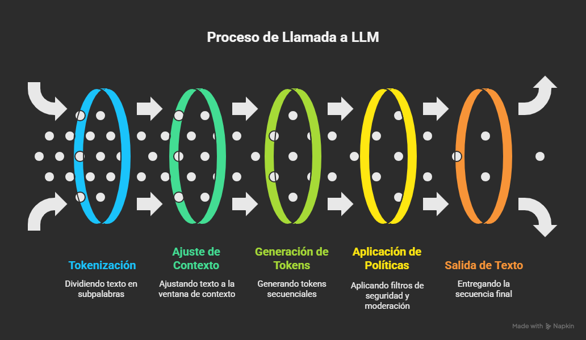
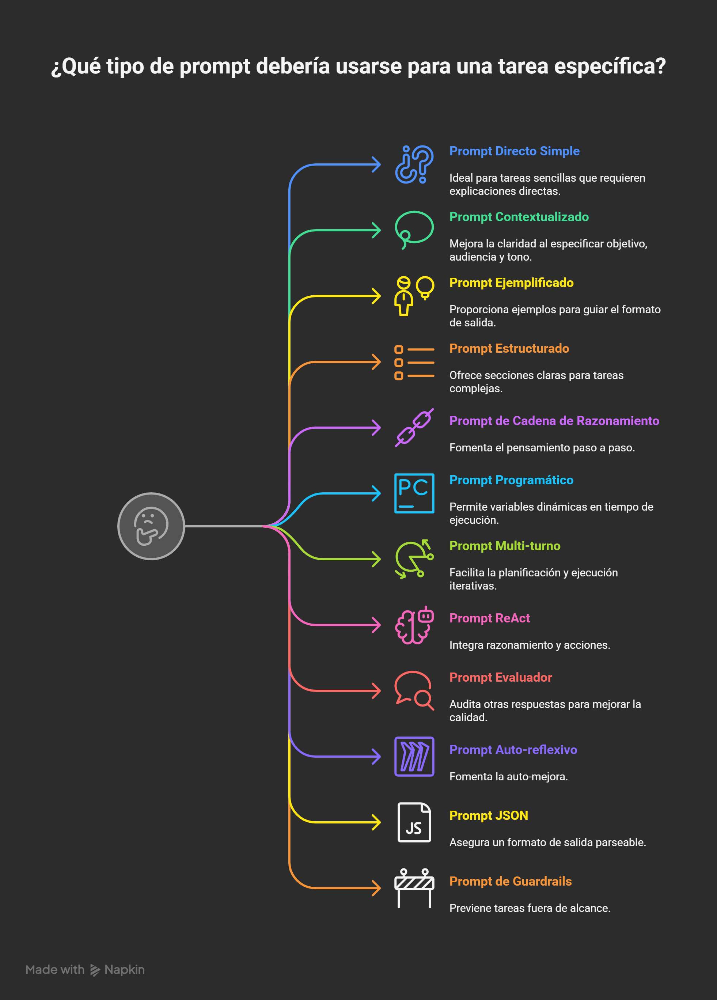
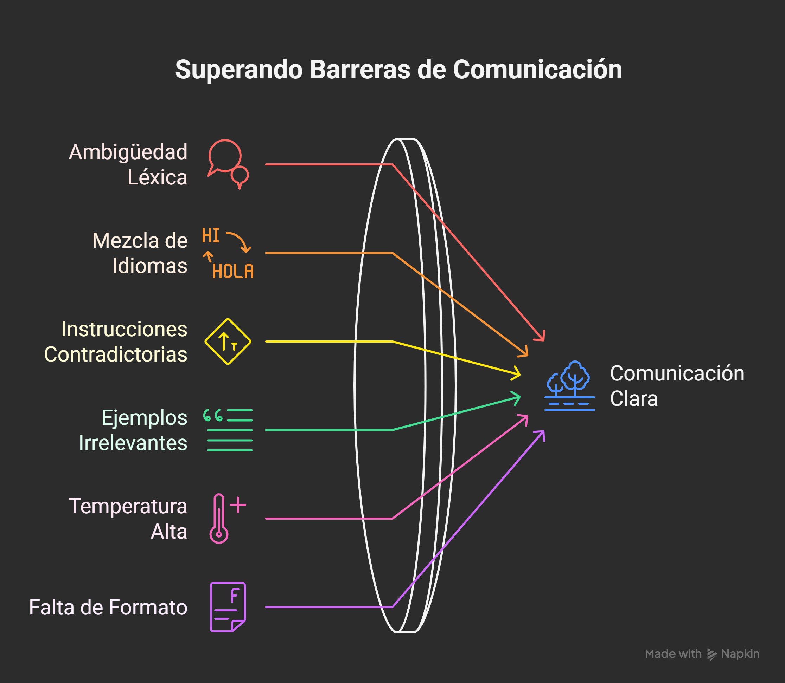

# Prompt Engineering Avanzado

Guía-taller participativa para aprender, practicar y evidenciar el impacto de diseñar prompts estructurados frente a preguntas simples en modelos de lenguaje (LLMs) como GPT-4/5 (futuro), Claude, Gemini, Llama, Mistral, etc.

---

## 1. Objetivos

Al finalizar podrás:

* Comprender qué ocurre “por detrás” cuando llamas a un LLM.
* Diferenciar tipos de prompts y roles (system, user, assistant, herramientas).
* Identificar fuentes de ruido y pérdidas de contexto.
* Diseñar prompts estructurados reutilizables (plantillas, frameworks).
* Iterar, evaluar y comparar calidad de respuestas (evidencia empírica).
* Aplicar técnicas avanzadas como:

  * Chain-of-Thought (CoT)
  * ReAct
  * Self-Consistency
  * Tree-of-Thought
  * JSON enforced
  * Guardrails
* Documentar y versionar prompts como activos de ingeniería.

---

## 2. Índice Rápido

1. Objetivos
2. Fundamentos del ciclo de inferencia
3. Tipos y roles de prompts
4. Anatomía de un prompt efectivo
5. Fuentes de ruido y degradación
6. Frameworks / Plantillas reutilizables
7. Técnicas avanzadas (con ejercicios)
8. Laboratorios comparativos (naive vs estructurado)
9. Evaluación y métricas de calidad
10. Gestión de memoria y contexto (olvidos aparentes)
11. Prompt Libraries y asistencia (con ejemplos)
12. Buenas prácticas de ingeniería (con ejemplos)
13. Checklist rápido de refinamiento (con ejemplos)
14. Referencias bibliográficas

---

## 3. Fundamentos: ¿Qué pasa cuando llamas a un LLM?

Flujo simplificado:

1. Tu texto (system + historial + user) se tokeniza (fragmentos subpalabra).
2. Se trunca o ajusta al límite del contexto (context window).
3. El modelo genera tokens secuenciales condicionados a todos los anteriores (atención). Cada token nuevo se realimenta.
4. Se aplican capas de filtrado / políticas (seguridad, moderación, formatos) según proveedor.
5. Se retorna la secuencia. Algunas APIs opcionalmente transmiten en streaming.

Razón de “se olvidó”:

* El contexto excede ventana → se descartan partes iniciales.
* Cambiaste la instrucción sin reforzar restricciones previas.
* Ambigüedad / colisión de reglas entre system vs user.
* Sobrecarga de ejemplos irrelevantes (ruido semántico).

---

## 4. Roles de Mensaje

* System: Marco, identidad, políticas invariables (define personalidad y límites).
* Developer (algunas APIs): Instrucciones internas de la app.
* User: Intención puntual / tarea específica.
* Assistant: Respuestas generadas; también actúa como memoria conversacional.
* Tool / Function Calls: Canal estructurado para delegar a herramientas externas.

Recomendación: Mantén el system breve, estable y testeado; versiona variantes.

---

## 5. Tipos de Prompt (Taxonomía práctica)

* Directo simple: “Explícame X”.
* Contextualizado: Añade objetivo, audiencia, tono.
* Ejemplificado (Few-Shot): Provee 1–N ejemplos con formato esperado.
* Estructurado / Plantilla: Secciones claras (Rol, Objetivo, Datos, Formato, Criterios, Restricciones, Pasos, Validación).
* Cadena de razonamiento (Chain-of-Thought): Pedir que explique pasos intermedios.
* Programático / Parametrizado: Placeholder variables ({{variable}}) inyectadas en runtime.
* Multi-turn plan & refine: Primero plan, luego ejecución.
* ReAct: Alterna razonamiento y acciones (llamadas a herramientas).
* Evaluador / Crítico: Prompt meta para auditar otra respuesta.
* Auto-reflexivo / Self-Improve: “Evalúa tu salida frente a criterios y reescribe”.
* JSON / Output Constrained: Forzar formato parseable.
* Guardrails / Políticas: Rechazar tareas fuera de alcance.

---

## 6. Anatomía de un Prompt Estructurado

Secciones recomendadas:

1. Rol / Contexto.
2. Objetivo claro (1 frase).
3. Entrada explícita (datos, supuestos). Si algo falta: pedirlo.
4. Formato de salida (ej. JSON con schema + validación).
5. Criterios de calidad (ej.: exactitud factual, concisión <300 palabras, tono neutral).
6. Proceso sugerido (pasos numerados).
7. Restricciones (idioma, evitar jergas, citar fuentes).
8. Ejemplos positivos / negativos.
9. Mecanismo de verificación / auto-revisión.

---

## 7. Fuentes de Ruido

* Ambigüedad léxica.
* Mezcla de idiomas sin aclarar preferencia.
* Instrucciones contradictorias en mensajes distintos.
* Ejemplos irrelevantes o demasiado largos.
* Temperatura alta para tareas de precisión.
* Falta de formato → dificulta parseo y automatización.

Mitigación: limpieza, normalización, chunking, delimitar con triple backticks \`\`\` para separar bloques.

---

## 8. Frameworks / Plantillas

Plantilla genérica:
SYSTEM: Eres un <rol> experto en <dominio>. Sigue estrictamente el formato indicado.

USER:
Objetivo: <en una frase>
Datos de entrada:
\<bloque\_datos>

Formato de salida (JSON):
{
"resumen": string,
"pasos": string\[],
"riesgos": string\[]
}

Restricciones: Español neutral, máximo 250 palabras en resumen.
Proceso: 1) Analiza 2) Enumera riesgos 3) Sintetiza.
Validación: Si faltan datos críticos, pide aclaración antes de responder.

Mini-frameworks conocidos: RTF, CRISPE, IDEA, PASSPORT.

---

## 9. Técnicas Avanzadas (con Ejercicios)

1. Chain-of-Thought (CoT)
2. Self-Consistency
3. ReAct
4. Tree-of-Thought
5. Auto-Reflexión
6. Output Guardrails
7. Tool Augmentation

---

## 10. Laboratorios Comparativos

* Laboratorio A: Resumen técnico.
* Laboratorio B: Refactor de código.
* Laboratorio C: Razonamiento matemático.
* Registro de evidencia: tabla comparativa de resultados.

---

## 11. Prompt Libraries y asistencia (con ejemplos)

* Ejemplo de uso de PromptHub para centralizar plantillas.
* Ejemplo de biblioteca en GitHub Awesome Prompting.
* Ejemplo de OpenAI Prompt Examples aplicados a JSON formatting.

---

## 12. Buenas Prácticas de Ingeniería (con ejemplos)

* Versionado de prompts con Git.
* Test automatizado: validar que un prompt siempre retorne JSON parseable.
* Uso de placeholders parametrizados ({{nombre\_usuario}}).

---

## 13. Checklist rápido de refinamiento (con ejemplos)

1. ¿Rol explícito? → Ejemplo: “Rol: Profesor de IA”.
2. ¿Objetivo 1-línea? → Ejemplo: “Explicar atención en transformers”.
3. ¿Formato salida definido? → Ejemplo: “Formato JSON {resumen: string}”.
4. ¿Criterios calidad medibles? → Ejemplo: “Máximo 200 palabras”.
   … hasta completar los 10 ítems del checklist.

---

## 14. Referencias bibliográficas

* Vaswani et al. (2017). *Attention Is All You Need*.
* Brown et al. (2020). *Language Models are Few-Shot Learners (GPT-3)*.
* Wei et al. (2022). *Chain-of-Thought Prompting Elicits Reasoning*.
* Yao et al. (2022). *ReAct: Synergizing Reasoning and Acting*.
* Kojima et al. (2022). *Large Language Models are Zero-Shot Reasoners*.
* Wang et al. (2022). *Self-Consistency Improves Chain of Thought*.
* Shinn et al. (2023). *Reflexion: Language Agents with Verbal Reinforcement Learning*.
* Besta et al. (2024). *Graph of Thoughts*.
* HuggingFace Agents Course.
* OpenAI Prompt Engineering Guide.

---

